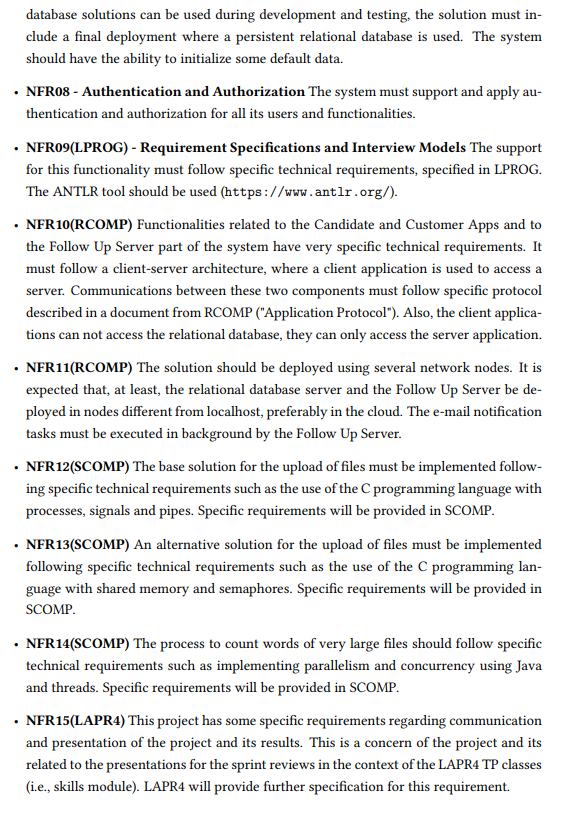

# US_G001 -  As Project Manager, I want the team to follow the technical constraints and concerns of the project

## 1. Context

*This user story consists in the group to follow the technical constraints and concerns of the project, that are described in Section 3.2 of the project specification. *

## 2. Requirements

*For this to work, we will have to understand the constraints and concerns in this first sprint, so that things go according to plan. *

## 3. Analysis

*No need for diagrams for this user story.*

## 4. Design

*Printscreens I took, so we can always check the constraints and concerns of the project without needing to enter the system specification again, for this matter.*

### 4.1. Realization

### 4.3. Applied Patterns

### 4.4. Tests

*No need for testing in this user story.*

## 5. Implementation

## 6. Integration/Demonstration

## 7. Observations
