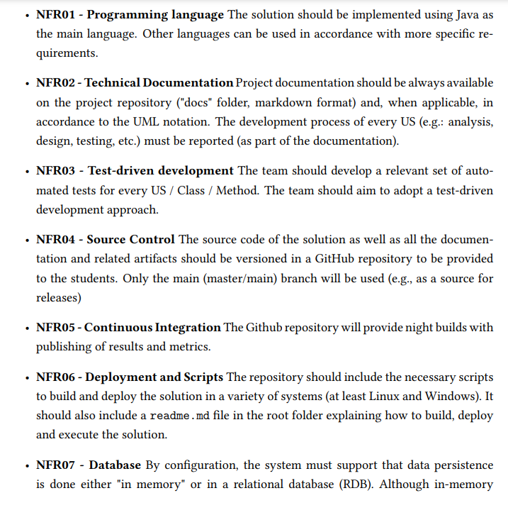

# US G001

## 1. Context

*This user story consists in the group to follow the technical constraints and concerns of the project, that are described in Section 3.2 of the project specification. *

## 2. Requirements

* Technical Constraints of the Project: the team will have to follow those technical constraints and specifications.

**US G001** As Project Manager, I want the team to follow the technical constraints and concerns of the project;

**Acceptance Criteria:**

**G001.1.** 2 images, from Section 3.2 of the system specification should be taken and put on the repository, so that each student can read them without having to open the system specification.

**G001.2.** Confirm that all team members are aware of the technical constraints and concerns relevant to their roles and responsibilities within the project.

**G001.3.** Integrate the technical constraints and concerns into the project plan, including timelines, deliverables, and resource allocations.

**G001.4**  Schedule regular reviews or checkpoints to assess adherence to the technical constraints and concerns throughout the project lifecycle.

**G001.5** Provide necessary training and support to team members to help them understand and comply with technical constraints and concerns effectively.

**Dependencies/References:**

- No dependencies were found.

## 3. Analysis

*Technical constraints play a crucial role in shaping the project's development process, ensuring compatibility, security, scalability, and other essential aspects of the final product. 
Ignoring or neglecting technical constraints can lead to project delays, increased costs, and compromised quality.*
*Comprehensive documentation of technical constraints and concerns promotes transparency and ensures that all team members have access to essential information. 
This documentation serves as a reference point throughout the project lifecycle and helps in making informed decisions.*

## 4. Design

*Printscreens I took, so we can always check the constraints and concerns of the project without needing to enter the system specification again, for this matter.*

*A project kickoff meeting was done, where the technical constraints were the main topic.*
*The team should schedule regular updates or meetings to communicate any possible changes or updates in the technical constraints.*
### 4.1. Realization

### 4.2. Class Diagram

*As this aspect of the requirement pertains more to project setup and configuration rather than software design,
a class diagram is not applicable in this context.*

### 4.3. Applied Patterns
*No specific design patterns are applied in this scenario, as the focus is on getting the group to follow the technical constraints of the project,
rather than implementing software functionality.*

### 4.4. Tests

*Given the nature of this requirement, direct testing is not applicable.*

## 5. Implementation

*No implementation required in this user story.*

## 6. Integration/Demonstration

*This integration gives the group a key visibility of the work to do in the future.*

## 7. Observations
