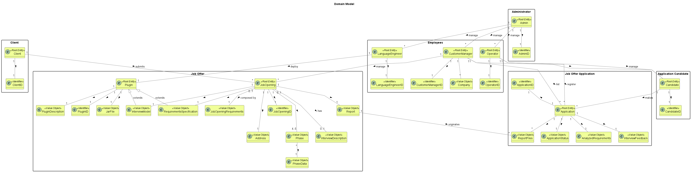

# US G006

## 1. Context

*This task involves developing a Domain Model for the system. 
This is the first time this task is being addressed in the project. 
A Domain Model is crucial for understanding the key concepts, entities, 
and relationships within the system, aiding in better communication among stakeholders and guiding 
the development process.*

## 2. Requirements

**US G006** As Project Manager, I want the team to elaborate a Domain Model using DDD.

**Acceptance Criteria:**

**G006.1.** The Domain Model should accurately represent the key entities and relationships within the system.

**G006.2.** The Domain Model should follow Domain-Driven Design (DDD) principles.

**Dependencies/References:**

*This task is fundamental for understanding the system architecture and guiding further development.*

## 3. Analysis

*We studied business requirements, talked to the client, and analyzed existing documentation to design the Domain Model, ensuring it captures all essential elements.*

## 4. Design

*We created a class diagram to visualize the entities and relationships in the Domain Model.*

### 4.1. Realization

Creating the Domain Model is a significant step forward, laying the groundwork for the project's development.

### 4.2. Domain Model

### 4.3. Applied Patterns

*No specific design patterns were used; our focus was on accurately representing the domain.*

### 4.4. Tests

*No tests are applicable at this stage.*

## 5. Implementation

*Since the Domain Model is conceptual, no implementation is needed now.* 

## 6. Integration/Demonstration

*The Domain Model will be integrated into the system, ensuring consistency across components.*

## 7. Observations

*Creating the Domain Model is crucial for understanding the system's core. It sets the foundation for future development and aligns stakeholders' understanding.*