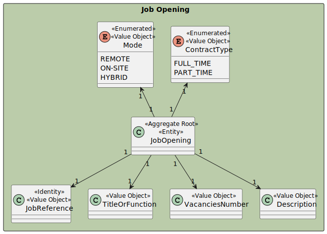

# US 1004 - Edit a Job Opening

## 1. Context

The goal is to provide the Customer Manager with the ability to edit a job opening details.

This task is not related to fixing a bug but rather adding a new feature to the system.

## Client Specifications

> *Question*: Q144 Isabel – US 1004 - Edit a job opening – No seguimento da US 1004 para permitir editar um job opening, estamos a assumir que é permitido alterar: Nº de vagas; Morada; Contract Type('FULL_TIME', 'PART_TIME'); Mode ('ON_SITE','REMOTE'); Description; Funcao. Estamos na linha de raciocício correta, ou é necessário alterar a lista para incluir outra informação adicional ou suprimir alguma desta lista?
>
> *Answer*: A144 Por favor ver A109 e Q117. Do meu ponto de vista deve ser possível alterar “tudo” exceto o próprio job reference. Deve-se ter em conta a manutenção do estado de consistência do sistema

> *Question*: Q150 Correia – US 1004 – Quando o Costumer Manager quer editar uma Job Opening, é suposto ele escolher qual Job Opening quer editar a partir de uma pesquisa pela referência?
> 
> *Answer*: A150 Relacionada com a Q123. A questão refere-se um pouco a boas práticas de UI/UX. O contexto indicado na pergunta refere-se a uma situação em que o utilizador tem de identificar a entidade/objeto que deseja editar. Pode-se assumir que o utilizador sabe esse identificador. Mas, em termos de UX/UI deve ser possível obter esse identificar por outras vias (até porque é um identificar gerado pelo sistema). Penso que, para este caso particular, existe já uma US que permite fazer isso.

> *Question*: Q154 Rodrigo – US 1004 - Em quais ou até que fases de recrutamento de um Job Opening em que pode-se editar as informações dela? E quais são as informações que podem ser editadas dentro de uma Job Opening?
>
> *Answer*: A154 Ver Q144. As alterações devem ser compatíveis com o “momento” em que estamos nessa job opening. Por exemplo, não faz sentido alterar o contract type se já estamos a receber candidaturas. Essas candidaturas foram feitas segundo uma descrição da oferta de emprego e não faz sentido estar a alterar depois de as pessoas se candidatarem. Mas, por exemplo, deve ser possível alterar o job requirements specification (refere-se a outra US) enquanto as pessoas se candidatam, pois é um aspeto técnico, que não é do conhecimento público. Portanto, devem ter em conta este tipo de preocupações

> *Question*: Q156 Rodrigo – US1004 - A cada edição feita de alguma informação numa Job Opening, é necessário registar a data e a hora da edição, tal como acontece no momento de registar a Job Opening
> 
> *Answer*: A156 Não me recordo da indicação de registar data e hora no momento de registar um job opening. Mas sobre este tema, e em geral, é comum haver um registo do utilizador que criou ou fez a última atualização de um “registo” no sistema. Outra boa prática é as aplicações terem sistemas de log para situações deste género. Mas não me recordo de haver algum requisito não funcional que mencione um sistema de log para este nosso projeto (exceto o do application file bot).

> *Question*: Q173 Correia – US1004 - Relativamente a esta US, é suposto conseguir editar que parâmetros da job opening?
> 
> *Answer*: A173 Pergunta “repetida”. Veja por favor Q144 e outras relacionadas com este assunto

> *Question*: Q193 Bernardo Barbosa – US 1004 - Edit a Job Opening (Active Since e Customer) – Tendo em conta a us1004 já referiu em questões passadas que deveria ser possível editar todos os atributos de job Opening , excepto a job Reference. No entanto, pergunto se faria sentido editar a data ativa (active since) de uma job Opening uma vez que é um registo único de quando a Job Opening ficou ativa. Pergunto também se seria também possível editar o Customer associado a job Opening,uma vez que a Job Reference se baseia no Customer. Dada a impossibilidade de edição de Job Reference pergunto se faria sentido a edição de customer também.
> 
> *Answer*: A193. Penso que se refere à Q144. Estou de acordo com as suas preocupações. É isso a que me refiro quando na Q144 escrevo “Deve-se ter em conta a manutenção do estado de consistência do sistema.”

> *Question*: Q203 Bernardo Barbosa – US 1004-Dúvida de Edição Atributos – Como esclareceu na questão 154 no ficheiro de questões, mencionou que não faria sentido editar o Contract Type se estivéssemos já na fase de Candidaturas. Pergunto se também faria sentido não ser editável nesta fase o Mode, assim como a sua morada e a função (Como "Front-end Programmer"), uma vez que são atributos que um candidato tem em mente quando faz uma candidatura a uma Job Opening. Pergunto também se o Job Requirements não deveriam ser editáveis a partir da frase screening (assim como o Interview Model na fase Interviews) uma vez que esta é a fase em que estes são verificados. Por fim pergunto : O número de vagas é editável em todas as fases ?
>
> *Answer*: A203. No geral o que refere está correto. As informações públicas de uma job opening não devem ser alteradas depois de serem tornadas públicas. Quanto a informações não públicas e mais técnicas penso que é aceitável que possam ser alteradas se não resultarem em possíveis estados incoerentes do sistema.

> *Question*: Q225 bernardo Barbosa – US 1004 - Editar fase atual- Ao "editar uma JobOpening" seria possível editar a sua fase atual nesta user story?
> 
> *Answer*: A225. A intenção desta US é permitir a edição dos dados que caracterizam a job opening do ponto de vista de conceito de negócio. A alteração das fases tem uma US especifica.

> *Question*:Q234 Luis Estebainha – US 1004 - Gostava de saber se é pretendido que seja possível modificar uma Job Opening cujo Recruitment Process ainda não esteja definido.
> 
> *Answer*: A234. Este assunto já foi amplamente discutido. Nesse caso em particular parece-me até que não havendo fases não existe sequer a definição das datas para a fase de application (terão os candidatos conhecimento das datas de candidatura?), pelo que estaremos talvez mais “livres” para fazermos alterações?

## 2. Requirements

**US 1004** As Customer Manager, I want to edit a job opening

**Acceptance Criteria:**

- G1004.1 - The system should allow the Customer Manager to edit a job opening.
- G1004.2 - The system should validate the data entered by the Customer Manager.
- G1004.3 - The system should persist the changes made by the Customer Manager.
- G1004.4 - The system should ensure that the job reference is not editable.
- G1004.5 - The system should ensure that the job opening is not editable if it isn't in the "Draft" phase.

**Dependencies/References:**

Furthermore, it is necessary to choose a job opening to edit. This is done in the context of the following user stories:
Has dependency in the user stories:

- 1002 - As Customer Manager, I want to register a job opening.

## 3. Analysis

### 3.1. Domain Model

The domain model is composed of the following entities:

- **JobOpening**: Represents a job opening in the company.

## 3.2 System Sequence Diagram

The Customer Manager requested a feature to edit a Job Opening
The system should have validations to ensure that the data is valid.

## 4. Design

### 4.1. Realization

The realization of the functionality involves defining how the Customer Manager can edit a job opening.
This requires interactions between various system components including the UI, business logic,
and data persistence layers.

## 4.2 Sequence Diagram

The sequence diagram shows the interactions between the Customer Manager and the system to rank candidates.
This includes actions like viewing a list of candidates, assigning a rank, saving the rank, and modifying it later.

## 5. Implementation

- The implementation of job opening editing feature involves several key components: the UI layer,
  the business logic layer, and the persistence layer.
  The primary goal is to allow the Customer Manager to edit a job opening.
- The implementation also ensures that all changes are persisted.

* Controller (EditJobOpeningController): Manages the interaction with the JobOpeningService to edit job openings.

* Repository (JobOpeningRepository): Handles the persistence of the job opening and its new data.

* Service (JobOpeningService): Handles the business logic for editing a job opening and persists the changes using the repository.

* UI (OrderedCandidatesUI): Provides a user interface for the Customer Manager to input and view job opening data.

## 6. Integration/Demonstration

* Integration with other system components was verified by:

- Ensuring that the EditJobOpeningController correctly interacts with the JobOpeningService.
- Validating that the JobOpeningService correctly persists changes using the JobOpeningRepository.
- Testing the complete workflow from the UI to the service and persistence layers.
- To demonstrate this functionality:

1) Run the backoffice application.
2) Log in as a Customer Manager.
3) Navigate to the edit a job opening option.
4) Input a job opening reference and edit the desired fields.

## 7. Observations

* During development, the following considerations were made:

- UI/UX: The UI was designed to be intuitive, allowing the Customer Manager to easily choose what he wants to edit.
- Extensibility: The current implementation is modular, allowing for easy updatability if job opening entity changes are made.
- Alternative solutions considered included using a loop so the user can keep editing want he wants until he is satisfied.
- The current implementation was chosen for its simplicity and ease of use.