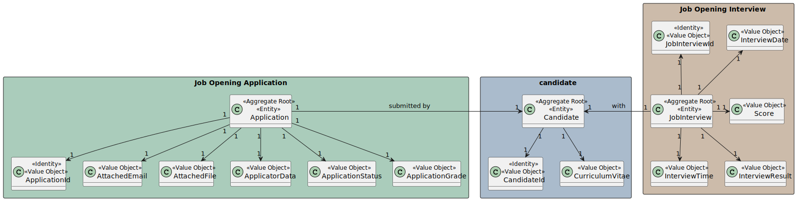
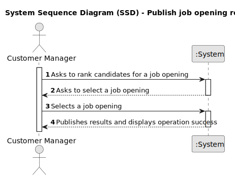
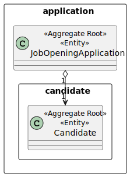

# US 1020 - As Customer Manager, I want to publish the results of the selection of candidates for a job opening

## 1. Context

In this User Story we are going to implement the functionality that allows the user to automatically  publish  the results of a job opening  by email. 

## 2. Requirements

The requirements for this User Story are:

**US G002** As {Ator} I Want...

**Acceptance Criteria:**

- G002.1. The system should automatically send an email to all candidates who have applied for the job opening, informing them of the result of the selection process.

- G002.2. The client/costumer should receive an email with the result of the selection process.

**Dependencies/References:**

* The system should allow the user to create a job opening.
* The system should allow the user to compare the requirements of the job opening with the candidates' profiles.
* The system should allow the user to rank candidates according to the requirements of the job opening.

## 3. Analysis

### 3.1. Domain Model

## 3.2 System Sequence Diagram

## 4. Design

### 4.2. Class Diagram

## 5. Observations
n/a