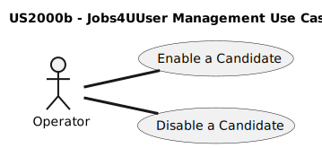
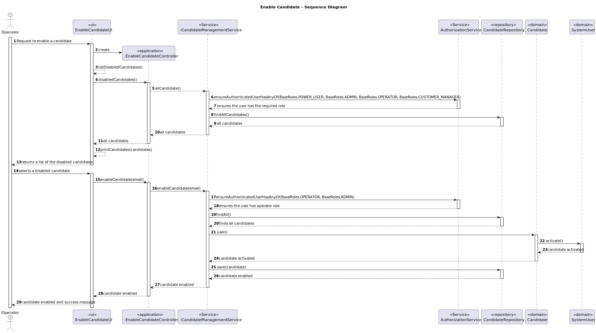

# US 2000b

## 1. Context

This task involves enabling the Operator to enable/disable a candidate in the system. This task is prioritized as essential to streamline candidate assessment.

## 2. Requirements

**2000b** As Operator, I want to enable/disable a candidate

**Acceptance Criteria:**

- 2000b.1. The system provides a functionality for Operators to enable/disable candidates inside the system.

- 2000b.2. The system shall provide a registration form to input the candidate's email.

- 2000b.3. The candidate's information (if he's active or disabled) shall be saved in the system's database, ensuring data integrity and accessibility.

**Dependencies/References:**

- G007 - As a Project Manager, I want the system to support and apply authentication and
  authorization for all its users and functionalities.

- 2000a - As Operator, I want to register a candidate and create a corresponding user.
- 
- ...

### Client Clarifications

-Q30 Alejandro – US2000b, o que é o enable/disable do candidato?
-A30. (alguma referencia a Q23). Refere-se a desativar o acesso do candidato ao sistema (i.e., Candidate App)

-Q146 Alejandro – US 2000b – for the use case 2000b which states "As Operator, I want to enable/disable a candidate". I would like to know if the client would like two different menus to be created, with each menu responsible for either activating or deactivating candidates.
-A146 I have no specific requirements for the UX/UI but I want you to follow best practices.

-Q213 Vitorino – US2000b – Na us 2000b, é suposto ao desativar um candidato, apenas lhe retirar a role e deixa-lo como user ao desativa-lo completamente?
-A213. Ver Q30. Considero que o objetivo desta US é permitir bloquear e desbloquear o acesso de um candidato ao sistema. Isso não deve invalidar as candidaturas dessa pessoa, apenas o acesso desse candidato ao sistema.

## 3. Analysis

Functional Requirements: 

Enable/Disable Candidate Functionality:

Candidate Listing:
A web interface must be created to list all candidates.
The interface should differentiate between enabled and disabled candidates.
Provide an option to filter the list to show only enabled or only disabled candidates.

Enable/Disable Action:
The system should include an enable/disable option next to each candidate.
Upon choosing the email to enable/disable, the system should prompt the Operator with a confirmation dialog to prevent accidental changes.

Status Update:
Once the Operator confirms the action, the system should update the candidate’s status in the database.
The system should ensure that the candidate's email address remains unique and other integrity constraints are maintained during the status update process.

Data Storage:
Candidate status (enabled or disabled) must be stored in a relational database.
Ensure data integrity and enforce constraints such as unique email addresses.

Feedback to Operator:
The system should provide immediate feedback about the success or failure of the enable/disable action.
The feedback message should include details such as the candidate's name and their new status.

Non-Functional Requirements
Security:
Ensure only authorized Operators can enable or disable candidates.
Implement secure handling and storage of candidate data to prevent unauthorized access.

Performance:
The system should perform enable/disable operations efficiently to maintain a smooth user experience.
The interface should update the candidate's status in real-time without requiring a page refresh.

Usability:
The interface should be intuitive and user-friendly, minimizing the steps required to enable or disable a candidate.
Provide clear visual indicators for the current status of each candidate.

Reliability:
Ensure that the enable/disable functionality works consistently and handles any potential errors gracefully.
Implement proper error handling and rollback mechanisms in case of database update failures.
Dependencies and Constraints

Database:
Use an existing relational database to store candidate information and status.
Ensure the database schema supports storing candidate statuses and maintaining data integrity.

User Authentication:
Integrate with the existing user authentication system to verify the identity and permissions of the Operator performing the enable/disable actions.

Risk Assessment

Data Integrity Risks:
Ensure that enabling/disabling a candidate does not result in data inconsistencies or integrity issues in the database.

Security Risks:
Prevent unauthorized access to the enable/disable functionality by implementing proper access controls.

Usability Risks:
Address potential usability issues by conducting user testing and gathering feedback from Operators.
### 3.1. Domain Model

The domain model is composed of the following entities:

- **Candidate**: Represents a candidate that will be disabled or enabled.
- **SystemUser**: Represents a system user, that in this case will be a candidate.

## 4. Design

### 4.1. Realization

A functionality is implemented within the system to allow Operators to enable/disable a candidate so that the candidate has access (or not) to the system.

## 4.2 Class Diagram

The class diagram shows the key classes involved in the enabling or disabling a candidate.
This includes the Candidate and the SystemUser.

## 4.3 Sequence Diagram

The sequence diagram shows the interactions between the Operator and the system to disable/enable a candidate.
This includes actions like viewing the list of candidates enabled/disabled, choose one of them, and enable/disable him.

## 5. Implementation

The system features functionality for enabling/disabling candidates enabling Operators to customize the status of a candidate.

* Controller (EnableCandidateController/DisableCandidateController): Manages the interaction with the CandidateManagementService to enable or disabling candidates.

* Repository (CandidateRepository): Handles the persistence of the data.

* Service (CandidateManagementService): Handles the business logic for enabling/disabling candidates and persists the changes using the repository.

* UI (EnableCandidateUI/DisableCandidateUI): Provides a user interface for the Operator to select a candidate from the list of candidates and enable/disable them.

## 6. Integration/Demonstration

* Integration with other system components was verified by:

- Ensuring that the ListCandidatesController correctly interacts with the CandidateManagementService.
-  Ensuring that the EnableCandidateController/DisableCandidateController correctly interacts with the CandidateManagementService.
- Validating that the CandidateManagementService correctly persists the status of the candidate using the CandidateRepository.
- Testing the complete workflow from the UI to the service and persistence layers.
- To demonstrate this functionality:

1) Run the application.
2) Navigate to the Enable Candidate UI / Disable Candidate UI
3) Select a candidate from the list to enable/disable. 
4) Verify that the candidate status was changed in the database.

## 7. Observations

* During development, the following considerations were made:

- UI/UX: The UI was designed to be intuitive, allowing the Operator to easily enable and disable candidates.
- Performance: The enabling/disabling operation was optimized to ensure quick response times, even with a large number of candidates in the list.
