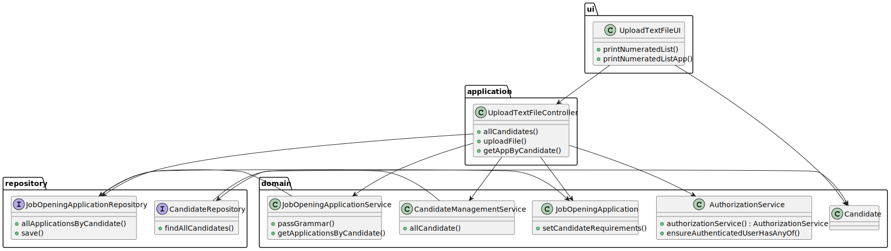
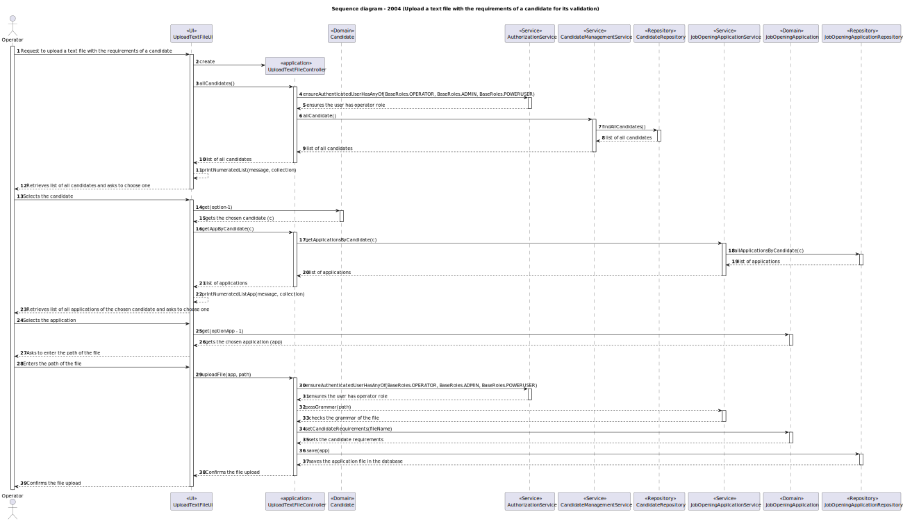

# US 2004

## 1. Context

This task involves enabling the Operator to upload a text file with the requirements of a candidate for its verification. This task is prioritized as essential to streamline the candidate's verification.

## 2. Requirements

**2004** As Operator, I want to upload a text file with the data fields (requirements) of a candidate for its verification.

**Acceptance Criteria:**

- 2004.1. The system provides a functionality for Operators to upload a text file with the requirements of a candidate for its verification.

- 2004.2. The system shall provide a form to choose which candidate's email we want to upload the file.

- 2004.3. The file should be created with the curriculum vitae of the candidate, for its verification.

- 2004.4. The requirements should be verified by the system, and a success message should be sent by the system.

**Dependencies/References:**

- 2003 - As Operator, I want to generate and export a template text file to help collect data fields for candidates of a job opening (so the data is used to verify the requirements of the job opening).

This user story is a dependency for 2004, 

- 1015 - As Customer Manager, I want to execute the process of verification of requirements of applications for a job opening.

This user story is a dependency for 1015, as the process of verification of the requirements can only be done when this user story is done. 

### Client Clarifications

-Q15 Ricardo – É o Operador que regista uma candidatura ou é o sistema que o faz automaticamente? E como integra o “plugin” de verificação da candidatura neste processo?
-A15 Na US 2002 o Operator regista a candidatura. Para isso, é o Operator que inicia o processo mas o sistema deve importar os dados resultantes do Application File Bot de forma “automática” (Ver References da US 2002). O plugin referido entra neste processo através da US 2003, em que o Operador gera um ficheiro template com os dados a introduzir para validar uma candidatura. Na US 2004, o Operador, após preencher os dados específicos da candidatura (com base no ficheiro template anterior) submete no sistema esse ficheiro que vai ser usado para o sistema avaliar/verificar a candidatura. Se os critérios não forem atingidos a candidatura é recusada.

-Q119 Caracol – Management of screening data - We have a question about the management of the screen phase of the recruitment process. Specifically, after the applications are filtered during the screening process, I'm unsure about who manages the results and oversees this phase. Could you please clarify if the responsibility for managing the screening results falls under the customer manager, the operators, or both?
-A119. In US2003 and US2004 it is the Operator that “downloads” a template file to register the requirements, registers the answers for the requirements in the file, and then uploads the file. It is then the Costumer manager that executes the verification process (US1015) and executes the notification of the results (US1016)

- Q132 Varela – US1008 - US2003 - Usage of ANTLR- Is it possible to clarify the usage of ANTRL within user story 2003? You've stated in Q15, Q102 and Q119, that US2003 simply generates the file, while in US2004 the Operator defines the answers and uploads the file. Where is this file uploaded to? Given this, where is the usage of ANTRL in US2003 directed to?
- A132. Regarding the first question, although difficult it is possible to generate the template text file using ANTLR. If so, there we have the usage o ANTLR. Although, unless there is some specific evaluation requirement from LPROG, it is acceptable that the template file is hardcoded in the plugin (no need for any “complex” generation process/function). Regarding the second question, the file is uploaded to the system. The last question was answered first.

- Q166 Varela – US2004 - Requirements Answers - I'm having trouble understading where are the requirements answer obtained from the candidates, so that the operator can then register their answers in the template previously generated and submit them to the system. Are these answers already within the files processed by tge application fie bot?
- A166 Please see Q15, Q102, Q119 and Q123. We can assume that the operator has access to all the files submitted by the candidates (since he/she is the one that imports the files into the system – US2002). He/she can than consult these files in order to answer the questions in the requirements template file. She/he then submits the file with the answers (US2004).

- Q180 Varela – US2004 - Candidate Answers - Does US2004 only deals with the upload of the file to the system or also the registration of the candidate's answer by the Operator? I've seen many mentions about the file's answers but I want to understand if that aspect is also part of US2004.
- A180 In US2003 the Operator downloads a template file that he/she uses to register the candidate requirements. In US 2004, the Operator uploads a file with the requirements and the system should validate the file (verify of the syntax is correct). US 1015 is the one that executes the verification of requirements for the candidates (based on the previously uploaded files).

- Q218 Campilho – US2004 - Submissão de um ficheiro para verificação – O meu grupo tem uma dúvida em relação à US2004, nomeadamente sobre o processo de submissão do ficheiro. Gostaríamos de saber se "submeter o ficheiro para verificação" na US 2004 implica apenas guardar o caminho do ficheiro no sistema e fazer a sua análise sintática (como referiu na Q180) ou se envolve também a extração e armazenamento da informação contida no ficheiro em estruturas específicas para posterior verificação. Temos esta dúvida porque há User Stories em que está explícito que é suposto importar as informações dos ficheiros, como por exemplo na US2002: "As Operator, I want to register an application of a candidate for a job opening and import all files received". No entanto, na US2004 não está explícito o que significa "submeter o ficheiro"
- A218. Submeter o ficheiro significa “importar” o ficheiro para o sistema, verificando se está sintaticamente correto. O ficheiro passa a fazer parte do sistema, sendo possível operações posteriores sobre esse ficheiro/dados, como a US1015. Não quero/devo condicionar como é que isso é feito em termos de solução.

- Q223 Araújo – US 2004 – About the Us2004, in A180 you previously stated that "the Operator uploads a file with the requirements and the system should validate the file (verify of the syntax is correct). US 1015 is the one that executes the verification...". What should happen if the file failes this verification? Is the application instantly refused or do you have something else in mind?
- A223. A file that fails the verification means that that file has an error (syntactic error) it does not mean that the application does not meet the requirements. The user should fix the error and submit again. Only US 1015 results in approving or rejecting an application

- Q228 Araujo – US 2004 - About the Us2004, when the Operator uploads the text file, in which phase is this US going to be?
- A228. All the files of the candidate must have been imported before. These files will be necessary for the operator to be able to answer the questions in the requirements specification template. Only then can the operator upload the file with the answers. This is the normal sequence. Regarding the phase of the process, I think it will depend on the proposed solution. I am open to solutions that do not invalidate the data consistency of the system.

- ...
## 3. Analysis

Functional Requirements

File Parsing:
Develop a mechanism to read and parse the uploaded text file.
Extract candidate data fields from the text file (e.g., name, email, phone number, qualifications).

Data Validation:
Implement validation to ensure the extracted data fields meet the required format and constraints (e.g., valid email format, required fields not empty).
Handle errors gracefully, providing feedback to the operator if the file content is invalid or incomplete.

Candidate Data Verification:
Compare the extracted candidate data against predefined requirements.
Implement logic to verify if the candidate meets the specified requirements.

Feedback to Operator:
Provide feedback to the operator about the success or failure of the upload and verification process.
Display any errors or issues found during file parsing and data validation.
Provide feedback of the verification that the candidate meets, or not, the specified requirements.

Non-Functional Requirements

Performance:
Ensure that the file upload and data verification process is efficient and does not introduce significant latency.

Security:
Implement security measures to prevent unauthorized access and upload of malicious files.

Scalability:
Design the system to handle a large number of file uploads and verifications concurrently.

Usability:
Ensure the file upload interface is intuitive and easy to use for operators with varying levels of technical expertise.

Provide Feedback to Operator:
Display the results of the upload and verification process.
Inform the operator of any errors or issues encountered.

### 3.1. Domain Model

The domain model is composed of the following entities:

- **Candidate**: Represents a candidate that will be disabled or enabled.
- **SystemUser**: Represents a system user, that in this case will be a candidate.

### 3.2. System Sequence Diagram

The Operator requested a feature to upload a text file for the requirements of a candidate.
This feature will allow the operator to upload the file with the curriculum, and validate his requirements.
The system should have validations to ensure that the data is valid.

## 4. Design

### 4.1. Realization

A functionality is implemented within the system to allow Operators to upload a text file with the requirements of a candidate for its verification.

## 4.2 Class Diagram

The class diagram shows the key classes involved in the uploading of a file.

## 4.3 Sequence Diagram

The sequence diagram shows the interactions between the Operator and the system to upload the text file with the data fields of a candidate.

The system features functionality for enabling/disabling candidates enabling Operators to customize the status of a candidate.

* Controller (UploadTextFileController): Manages the interaction with the CandidateManagementService to showing the list of all the candidates in the system.

* Repository (CandidateRepository): Handles the persistence of the data.

* Service (CandidateManagementService): Handles the business logic for uploading the text file for the candidates and persists the changes using the repository.

* UI (UploadTextFileUI): Provides a user interface for the Operator to select a candidate from the list of candidates and upload a file with the data fields (requirements) for its verification.

## 6. Integration/Demonstration

* Integration with other system components was verified by:

- Ensuring that the UploadTextFileController correctly interacts with the CandidateManagementService.
- Validating that the CandidateManagementService correctly persists the requirements of the candidate using the CandidateRepository.
- Testing the complete workflow from the UI to the service and persistence layers.
- To demonstrate this functionality:

1) Run the application.
2) Navigate to the Upload Text File UI
3) Select a candidate from the list to upload his file.
4) Verify that the candidate requirements are in the new created file.

## 7. Observations

* During development, the following considerations were made:

- UI/UX: The UI was designed to be intuitive, allowing the Operator to easily upload the text file with the requirements of a candidate.
